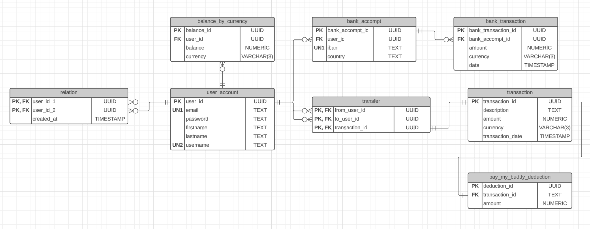

# Readme - PayMyBuddy

## Stack utilisée
Le projet est développé sur une base Java + Spring Boot (avec Spring Security et Spring DATA JPA). L'interface utilisateur est réalisé avec Thymeleaf et utilise Bootstrap.
La base de données utilisée est PostgreSQL.


> [!NOTE]
> Il s'agit d'un prototype dans le but de démontrer l'intérêt de l'application auprès des utilisateurs. L'application n'est pas "Responsive" et embarque des fonctionnalités minimales pour le moment.

## Mise en place de la base de données
La mise en place de l'application nécessite la création de deux bases de données :
- une première pour l'application de production,
- une seconde pour la réalisation des tests.

> [!IMPORTANT]
> Vous devez avoir une installation fonctionnelle de PostegreSQL pour pouvoir exécuter correctement l'application. Il faut également qu'un utilisateur ayant les droits suffisant soit créé.

### Création des bases

#### Première étape : connexion à la base de données
Dans une console :
```
psql -h <localisation de la base> -U <user>
```

#### Deuxième étape : créer les deux bases nécessaires au fonctionnement de l'application
```sql
CREATE DATABASE paymybuddy;
CREATE DATABASE paymybuddy_e2e;
```

#### Troisème étape : mise à jour des fichiers application.yml
Quatre fichier application.yml sont utilisés par l'application. Il faut mettre à jour la ligne suivante en fonction de l'utilisateur de votre base de données. Il faut faire l'opération pour les quatre fichiers.

Pour :
- application.yml
- application-dev.yml
- application-test.yml

```yml
spring:
  datasource:
    username: <user>
    password: <password>
    url: jdbc:postgresql://localhost:5432/paymybuddy
```

Pour :
- application-teste2e :

```yml
spring:
  datasource:
    username: <user>
    password: <password>
    url: jdbc:postgresql://localhost:5432/paymybuddy_e2e
```

> [!NOTE]
> Vous devez également modifier localhost:5432 si votre base de données n'est pas installée localement et/ou sur un port différent.

## Structure des données
### Diagramme UML


### Modèle d'implémentation Physique



## Remarques
### Fichiers application.yml
L'application possède 4 fichiers de configuration.

> application.yml

Il s'agit du fichier de base pour l'application en production.

> application-dev.yml

Sa configuration est similaire au fichier de production, la principale différence étant le paramétrage des fichiers static, permettant de visualiser les modifications réalisées les les templates html à la volée, sans le besoin de compiler et de relancer l'application :

```yml
spring:
  thymeleaf: # Thymeleaf
    cache: false
    mode: HTML
    encoding: UTF-8
    prefix: file:src/main/resources/templates/
  web:
    resources: # Static resources
      static-locations: file:src/main/resources/static/
      cache:
        period: 0
```

> application-test.yml

Utilisé pour les tests d'intégration de la base de données.

> application-teste2e

Utilisé pour les tests end-to-end (avec Selenium).
